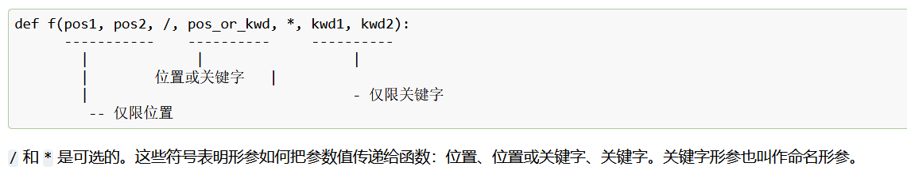

## 三重引号“”“”“”可以用来注释（文档字符串）
  #  原理：实际上是一个未被使用的字符串，因此不会被执行
  函数内的第一条语句是字符串时，该字符串就是文档字符串，也称为 docstring
  函数在定义时同样适用有默认值可省略参数列表的规则
  默认值在函数所在的位置进行定义，即函数之后对的再次赋值它无效 

 # 第一行应为对象用途的简短摘要。
 # 文档字符串为多行时，第二行应为空白行

## 函数参数传递方式
    传递的是对象的引用（指针），而不是对象本身
    对于不可变对象，表现类似"按值传递"
    对于可变对象，表现类似"按引用传递"
 # 即无需区分是否引用，解释器自行判断是否改变原有值，若是传递可变对象，就可改变
    /*在参数列表中的含义]
    仅限位置形参应放在 / （正斜杠）前。
  #  参数分位置参数和关键字参数
    参数列表中第一个 仅限关键字 形参前添加 *

